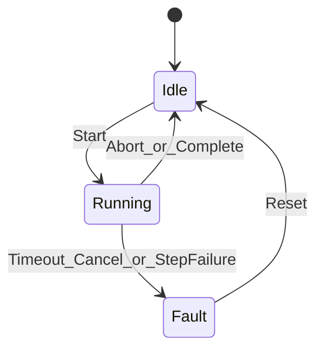

# P2 Workflow Cancel / Timeout / Fault

## Decisions (locked)

| Topic | Choice | Why |
|-------|--------|-----|
| Workflow engine | **Self-built** extend [`Station.Workflow`](src/Station.Workflow) | Already have explicit states + `StateTransitionGuard`; station HMIs need short, code-owned FSMs, not Elsa/WorkflowCore orchestration |
| Resilience library | **No Polly** in P2 | Cancel/timeout map cleanly to linked `CancellationTokenSource` + `CancelAfter`; avoid new package until HTTP/MES upload needs policy composition |
| Reference pattern | Thin **step runner** + state transitions (inspired by cooperative cancel patterns, not a full FSM package like Stateless) | Enough for stability; Stateless can be reconsidered only if transition tables grow large across many stations |

Polly remains a later option for **Data Pipeline / HTTP upload** retries, not for core station FSM.

## Target behavior



- **Cancel**: `AbortAsync` cancels a linked CTS so in-flight steps observe cancellation and land in `Fault` or `Idle` (Abort while Running → cooperative cancel → `Idle` if clean abort; unexpected errors → `Fault`).
- **Timeout**: each step (and optional whole-run) uses `CancelAfter`; timeout → `Fault` with reason.
- **Fault**: `Running`/`step` failure transitions to `Fault`; `ResetAsync` only from `Fault` → `Idle`.
- **Bounded retry**: small helper for device-ish steps (max attempts + delay), not infinite Polly-style policies.

## API shape (in `Station.Workflow`)

Extend beyond current [`IStationWorkflow`](src/Station.Workflow/IStationWorkflow.cs) / [`EmptyStationWorkflow`](src/Station.Workflow/EmptyStationWorkflow.cs):

- `WorkstationFaultInfo` (`Reason`, `OccurredAt`, optional `Exception` type name) when `State == Fault`
- `IStationWorkflow` additions:
  - `FaultInfo` property (null when not Fault)
  - `ResetAsync(CancellationToken)` — `Fault` → `Idle`
  - keep `StartAsync` / `AbortAsync`
- `WorkflowRunOptions` (timeouts, retry defaults) — config-friendly POCOs
- `WorkflowStepRunner` (internal/public helper):
  - `RunAsync(name, Func<CancellationToken, Task>, options)`
  - links caller token + abort CTS + step timeout
  - on cancel/timeout/exception → record fault reason; optional bounded retry for marked retriable failures
- `StationWorkflowBase` abstract base:
  - owns gate, state, abort CTS, `FaultInfo`
  - `StartAsync` creates linked CTS, calls `ExecuteAsync(ct)`, on success → `Idle`, on fault path → `Fault`
  - `AbortAsync` cancels abort CTS and waits briefly for run to observe cancel
  - `EmptyStationWorkflow` either stays as no-op or becomes a tiny subclass of the base for template DI

Events for UI (minimal): `event EventHandler<WorkstationState>? StateChanged` on the base (no full logging framework yet).

## App wiring ([`Station.App`](src/Station.App))

- [`MainViewModel`](src/Station.App/ViewModels/MainViewModel.cs): show `Fault` + reason; **Reset** command enabled only in Fault; Abort cancels run
- Replace DI registration of bare `EmptyStationWorkflow` with base-compatible template implementation
- Optional demo: `DemoDelayWorkflow` (2–3s delay step) registered only if useful for manual timeout/cancel checks—default keep empty/no-op for template purity; **tests** cover timeout/cancel with a test double workflow, not UI demo dependency

## Tests ([`Station.Workflow.Tests`](tests/Station.Workflow.Tests))

Add a `TestDelayWorkflow` (or runner unit tests) covering:

1. Start → Abort mid-step → ends Idle (or Fault if design chooses “abort = Fault”; **prefer Idle on user Abort**, Fault on timeout/exception)
2. Step timeout → `Fault` + reason contains timeout
3. Step throws → `Fault`
4. `ResetAsync` from Fault → Idle; Reset from Idle rejected
5. Bounded retry: fails twice then succeeds; exceeds max → Fault
6. Illegal transitions still rejected via [`StateTransitionGuard`](src/Station.Workflow/StateTransitionGuard.cs) (extend table if Reset needs `Fault→Idle` only—already present)

## Docs / rules

- Short note in [`docs/overview.md`](docs/overview.md) + [`AGENTS.md`](AGENTS.md): cancel/timeout/Fault semantics; “no Polly for workflow”
- Spec file: `docs/superpowers/specs/2026-09-09-p2-workflow-stability-design.md`

## Explicit non-goals

- No Polly / Stateless / WorkflowCore / Elsa
- No JSON/YAML workflow DSL
- No MES / persistence
- No device read-power UI (P1 stays as registration only)

## Verification

```powershell
dotnet build HardwareCtrlPlatform.sln
dotnet test HardwareCtrlPlatform.sln
```
