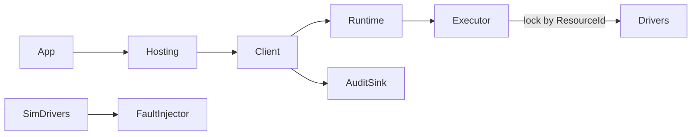

# P3 Device Runtime Deepening

## Scope lock (choice A)

- **In:** connect/disconnect/reconnect lifecycle, ResourceId + UDL session lifecycle, command audit, per-resource serial scheduling productization, Simulator fault injection
- **Out:** new business capabilities (power supply, temp, serial meters, etc.); Tag bus; MES; LabVIEW UI
- New capabilities remain a documented checklist only ([`docs/Device-Capability-Catalog.md`](docs/Device-Capability-Catalog.md) extension guidance)

## Current anchors

- Per-resource serial lock already in [`DeviceCommandExecutor`](src/Device.Server/Scheduling/DeviceCommandExecutor.cs) (`SemaphoreSlim` keyed by `resourceId`)
- Shared UDL session in [`UdlEngineSession`](src/Device.Drivers.Udl/UdlEngineSession.cs) (`OpenShared` / dispose)
- [`DeviceDefinition.ResourceId`](src/Device.Server/Registry/DeviceDefinition.cs) already flows into runtime
- Simulators always `Online` via [`SimulatedDeviceBase`](src/Device.Simulators/SimulatedDeviceBase.cs)



## 1. Connection lifecycle (Contracts + drivers + Hosting)

Add **lifecycle**, not a measurement capability:

- New interface [`IDeviceConnection`](src/Device.Contracts/Common/IDeviceConnection.cs) (optional on devices):
  - `Task<DeviceResult> ConnectAsync(CancellationToken)`
  - `Task<DeviceResult> DisconnectAsync(CancellationToken)`
  - `Task<DeviceResult> ReconnectAsync(CancellationToken)` (Disconnect then Connect)
- Existing `IOpticalPowerMeter` / Laser / Switch **also** implement `IDeviceConnection` where meaningful
- Simulator: Connect → `Online`, Disconnect → `Offline`; ops while Offline return `DeviceErrorCode.Offline`
- UDL COM drivers: Connect ensures `UdlEngineSession` open; Disconnect does **not** tear down process-wide shared session by default (document why); optional `ForceCloseSharedSession` only for host shutdown
- [`Device.Hosting`](src/Device.Hosting/DevicePlatformServiceCollectionExtensions.cs):
  - `AddDevicePlatform` registers `IDevicePlatformLifecycle`
  - `ConnectAllAsync` / `DisconnectAllAsync` at app start/exit (Station.App hooks)
- Debug Console: Connect / Disconnect / Reconnect buttons on Devices tab

## 2. ResourceId + UDL channel lifecycle

- Normalize: effective resource key = `ResourceId ?? DeviceId` (already in [`InProcessDeviceRuntime.ResolveResourceId`](src/Device.Server/Execution/InProcessDeviceRuntime.cs)); document in Hosting README
- Config: allow explicit `ResourceId` in entries so two logical devices can share one lock (same resource) or run parallel (different resources)
- UDL: centralize open in lifecycle Connect; Hosting `Dispose`/app exit calls session dispose once
- Tests: two devices different ResourceId → overlapping Execute allowed; same ResourceId → serialized (extend existing executor tests)

## 3. Command audit

- New types in Contracts or Server:
  - `DeviceCommandAuditEntry` (Utc timestamp, DeviceId, ResourceId, Capability, Operation, Success, ErrorCode, Message, DurationMs, RequestId)
  - `IDeviceCommandAuditor` with `Record` + `IReadOnlyList` recent window (e.g. last 200)
- Wire at [`InMemoryUdlServerClient`](src/Device.Client/InMemoryUdlServerClient.cs) dispatch boundary (one place covers all proxies)
- DI: `InMemoryDeviceCommandAuditor` registered from Hosting
- Debug Console: simple “Audit” log panel or append last N entries under existing Log
- Unit tests: one ReadPower produces an audit row

## 4. Scheduler productization

- Keep **default policy: serial per ResourceId, parallel across ResourceIds** (current behavior)
- Surface explicitly:
  - `IDeviceCommandExecutor` stays; add thin `DeviceSchedulerOptions` (optional wait timeout later— defer if YAGNI)
  - XML/doc comment + [`docs/Device-Runtime.md`](docs/Device-Runtime.md) explaining the policy
- Add metrics on executor (optional lightweight): last wait ms / in-flight count per resource—only if cheap; otherwise skip metrics and rely on audit DurationMs
- Tests already partially cover serial same-id / parallel different-id in [`DeviceCommandExecutorTests`](tests/Device.Server.Tests/DeviceCommandExecutorTests.cs)—harden and document

## 5. Simulator fault injection

- `FaultInjectionOptions` (config section `Devices:FaultInjection` or per-entry later):
  - `Enabled`
  - `FixedDelayMs`
  - `FailNextCount` or probability
  - `ForceOffline`
  - `CorruptPowerReading` (e.g. NaN / out-of-range flag via message)
- Apply inside Simulator drivers or a decorator `FaultInjectingDevice` wrapping resolved simulator devices in `CompositeDriverResolver` when Provider=Simulator and injection enabled
- Tests: delay observed; fail returns DriverError/Offline; Offline blocks ReadPower

## 6. Station.App / docs / verify

- App startup: `ConnectAllAsync` after host build; exit: `DisconnectAllAsync`
- Docs: [`docs/Device-Runtime.md`](docs/Device-Runtime.md) + update overview/AGENTS (no Polly; no new business caps this round)
- Spec: `docs/superpowers/specs/2026-09-09-p3-device-runtime-design.md`

```powershell
dotnet build HardwareCtrlPlatform.sln
dotnet test HardwareCtrlPlatform.sln
```

## Implementation order

1. `IDeviceConnection` + Simulator connect/offline behavior + tests  
2. Auditor + client wiring + tests  
3. Fault injection for Simulator + tests  
4. Hosting lifecycle + ResourceId docs + App connect-all  
5. Debug Console buttons + audit display  
6. Docs / AGENTS / full test pass  
