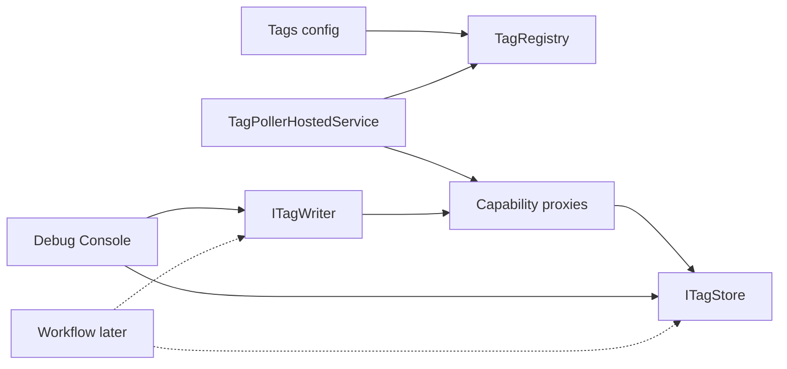

# P4 Tag Uplink/Downlink + Periodic Collection

## Scope lock

- **In:** Tag model (id/value/quality/timestamp), in-memory `ITagStore`, config-declared tag map, Hosting `BackgroundService` periodic poll for uplink, downlink write API routed to existing Capability proxies, Debug Console “Live Tags” panel, unit tests + docs
- **Out:** new device capabilities; OPC/UA; historians / DB; MES; trend charts; LabVIEW; event-push from drivers; Workflow Step binding (later P5)

Numbering: roadmap “Tag 数据面”; repo already has Device Runtime as P3 → this is **P4**.

## Design (locked)




Semantics:

- **Uplink:** poller reads via existing proxies → updates `TagSnapshot` (`Good` / `Bad` / `Stale`)
- **Downlink:** `ITagWriter.WriteAsync(tagId, value)` → mapped capability write (serial scheduling already via ResourceId)
- **Stale:** if last successful update older than `2 * PeriodMs` (or explicit `StaleAfterMs`)

## Placement

Keep layering: no COM in UI. Prefer fold into existing stack rather than a heavy new product:


| Piece                                                                       | Where                                                                                                                                                                                    |
| --------------------------------------------------------------------------- | ---------------------------------------------------------------------------------------------------------------------------------------------------------------------------------------- |
| `TagId`, `TagValue`, `TagQuality`, `TagSnapshot`, `ITagStore`, `ITagWriter` | `[Device.Contracts](src/Device.Contracts)` under `Tags/`                                                                                                                                 |
| `InMemoryTagStore`, `TagDefinition`, poll adapters                          | `[Device.Server](src/Device.Server)` or thin `[Device.Tags](src/Device.Tags)` project referenced by Hosting — **choose `Device.Tags` project** so Server stays IO-agnostic of UI polling |
| DI + `TagPollerHostedService` + options bind                                | `[Device.Hosting](src/Device.Hosting)`                                                                                                                                                   |
| Live Tags UI                                                                | `[DeviceDebugViewModel](src/Station.App/ViewModels/DeviceDebugViewModel.cs)` + XAML                                                                                                      |


`Device.Tags` depends on `Device.Contracts` + `Device.Client` (proxies) + `Device.Server.Registry` (definitions). Hosting references `Device.Tags`.

## Config shape (`Devices` sibling or nested)

```json
"Tags": {
  "DefaultPeriodMs": 500,
  "Entries": [
    {
      "TagId": "PM-01.Power",
      "DeviceId": "PM-01",
      "Access": "Read",
      "Capability": "IOpticalPowerMeter",
      "Operation": "ReadPower",
      "Args": { "channel": 0 },
      "PeriodMs": 200,
      "Unit": "dBm"
    },
    {
      "TagId": "TLS-01.Output",
      "DeviceId": "TLS-01",
      "Access": "Write",
      "Capability": "ILaserSource",
      "Operation": "SetOutput",
      "Args": {}
    }
  ]
}
```

v1 built-in adapters (hard-coded map, no reflection invent):

- Read: `IOpticalPowerMeter.ReadPower`, `IDevice.GetHealth` (map `State` / `IsHealthy` to string/bool tags)
- Write: `IOpticalPowerMeter.SetWavelength`, `ILaserSource.SetWavelength` / `SetOutput`, `IOpticalSwitch.SwitchTo` (value as structured object or two tags `In`/`Out` — prefer **single write with Args template + value override for primary field**)

Unknown Capability/Operation → registration fails fast at startup.

## Core types (sketch)

```csharp
public enum TagQuality { Good, Bad, Stale, Unknown }
public enum TagAccess { Read, Write, ReadWrite }

public sealed record TagSnapshot(
  string TagId, object? Value, string? Unit,
  TagQuality Quality, DateTimeOffset UpdatedUtc, string? Message);

public interface ITagStore {
  IReadOnlyList<TagSnapshot> Snapshot();
  bool TryGet(string tagId, out TagSnapshot? value);
  event Action<TagSnapshot>? Changed; // optional for UI refresh
}

public interface ITagWriter {
  Task<DeviceResult> WriteAsync(string tagId, object? value, CancellationToken ct);
}
```

Poller: one loop (or per-period groups), respects `CancellationToken`, calls adapters through `IUdlServerClient` / proxies, updates store; failures → `Bad` + message (do not crash host).

## App / UI

- Register tags in `AddDevicePlatform` (or `AddTagDataPlane` called from it)
- Start poller with Host (`IHostedService`)
- Debug Console: table of TagId / Value / Unit / Quality / Updated; write box for Write/ReadWrite tags; Start/Stop poll toggle optional (default on)
- Station tab unchanged this round

## Docs / verify

- Spec: `docs/superpowers/specs/2026-09-09-p4-tag-data-plane-design.md`
- User doc: `docs/Tag-Data-Plane.md`; update `[docs/overview.md](docs/overview.md)`, `[AGENTS.md](AGENTS.md)`, `[docs/Device-Debug-Console.md](docs/Device-Debug-Console.md)`
- Sample tags in `[appsettings.json](src/Station.App/appsettings.json)` for PM/Laser/Switch

```powershell
dotnet build HardwareCtrlPlatform.sln
dotnet test HardwareCtrlPlatform.sln
```

## Implementation order

1. Contracts + `InMemoryTagStore` + tests
2. `Device.Tags`: definitions, adapters, `TagWriter`, poller
3. Hosting options + DI + hosted service
4. Appsettings sample + Debug Console Live Tags
5. Docs + full test pass

## Constraints to preserve

- No Polly for Tag IO; reuse ResourceId serial executor via existing client path
- ViewModels call `ITagStore` / `ITagWriter` only — no COM / ProgID
- Do not invent UDL operations beyond existing capability catalog

